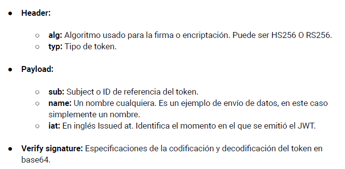

**Securización mediante JWT**

- **¿Qué es JWT?**

JWT (JSON Web Token) es un estándar abierto (RFC 7519) que define un método compacto y seguro para transmitir información entre partes como un objeto JSON. Esta información puede ser verificada y confiable porque está firmada digitalmente. 

- **¿Por qué debemos agregar seguridad a nuestros servicios?**

Agregar seguridad a nuestros servicios es fundamental para proteger datos sensibles, evitar fraudes y mantener la confianza de los usuarios. Sin medidas de seguridad adecuadas, la información puede ser interceptada, alterada o utilizada maliciosamente.

- **El modelo stateless**

El modelo stateless es un diseño de arquitectura en el que cada petición del cliente al servidor debe contener toda la información necesaria para entender y procesar la petición. Es decir, el servidor no guarda ninguna información del estado del cliente entre peticiones.

- **Seguridad con JWT**

La seguridad con JWT se logra a través de la firma digital del token. Dicha firma garantiza que los datos contenidos en el token no han sido alterados en tránsito. Esto, combinado con una comunicación segura (HTTPS), garantiza que la información es segura y confiable.

- **Firma de token**

La firma de un token se realiza a través de un algoritmo de cifrado (por ejemplo, HMAC, RSA). Esta firma ayuda a verificar la integridad de los datos y confirma que no se han alterado después de su creación.

- **Clave del servidor**

La clave del servidor es una cadena secreta que se utiliza para firmar y verificar JWT. Solo el servidor conoce esta clave, lo que garantiza que solo él puede generar y validar los tokens.

- **Proceso de autenticación**

El proceso de autenticación generalmente implica los siguientes pasos:

1. El usuario proporciona sus credenciales (por ejemplo, nombre de usuario y contraseña).
2. El servidor verifica estas credenciales y, si son válidas, genera un JWT firmado con la clave secreta del servidor.
3. Este JWT se envía al cliente, que lo almacena y lo incluye en sus solicitudes futuras.
4. El servidor verifica el JWT en cada solicitud para autenticar al usuario.

- **Tiempo de vida y caducidad del token**

El tiempo de vida de un token es el periodo durante el cual es válido. La caducidad del token se puede establecer en el campo "exp" del JWT. Después de esta fecha/hora, el token ya no es válido.

- **JWT vs variables de sesión y cookies**

JWT se puede usar en lugar de las variables de sesión y las cookies para mantener el estado de un usuario. A diferencia de las cookies y las sesiones, que requieren mantener un estado en el servidor, JWT es stateless y contiene toda la información necesaria en sí mismo.

- **Componentes de un JWT**

Un JWT consta de tres partes: Header, Payload y Signature.

1. **Header**: El encabezado generalmente consta de dos partes: el tipo de token, que es JWT, y el algoritmo de firma, como HMAC SHA256 o RSA.

2. **Payload**: El payload contiene las afirmaciones, que son declaraciones sobre una entidad (normalmente, el usuario) y metadatos adicionales.

3. **Signature**: Para crear la firma, se debe tomar el header codificado en base64, el payload codificado en base64, y firmarlos usando el algoritmo especificado en el header con la clave secreta.




- **Algoritmos de encriptación**

Los algoritmos de encriptación se utilizan para cifrar y descifrar los datos. En el contexto de JWT, se utilizan para firmar y verificar los tokens. Los algoritmos comunes incluyen HMAC SHA256 (HS256) y RSA.

- **El elemento iat**

El elemento "iat" (Issued At) es un campo estándar de JWT que indica cuándo se emitió el token. 

- **El código Base64**

El Base64 es un sistema de numeración que permite representar datos binarios en una cadena ASCII. En JWT, tanto el header como el payload son codificados en base64 para poder ser transmitidos fácilmente.

- **Almacenamiento en LocalStorage/SessionStorage**

El token JWT puede almacenarse en el navegador del cliente utilizando LocalStorage o SessionStorage. Esta es una forma conveniente de mantener el estado del usuario sin tener que enviar las credenciales en cada solicitud.

- **Revisión de algunos de los campos estándares de la mensajería**

Algunos campos estándar de JWT incluyen "iss" (emisor), "sub" (asunto), "aud" (audiencia), "exp" (tiempo de expiración), "nbf" (no antes de), "iat" (emitido en), y "jti" (ID del JWT).

**Implementación en Express**

- **Instalando el paquete jsonwebtoken**

Para instalar el paquete 'jsonwebtoken', simplemente ejecute el siguiente comando en su terminal:

```sh
npm install jsonwebtoken
```

- **Instalando el paquete express-jwt**

Para instalar el paquete 'express-jwt', ejecute:

```sh
npm install express-jwt
```

- **Configurar el paquete**

Después de instalar los paquetes, necesitará configurarlos en su aplicación Express. Aquí hay un ejemplo básico de cómo podría hacerlo:

```javascript
const express = require('express');
const jwt = require('jsonwebtoken');
const expressJwt = require('express-jwt');

const app = express();
const secret = 'my_secret_key'; // Nunca exponga esto en producción. En su lugar, guárdelo en variables de entorno.

app.use(expressJwt({ secret: secret }).unless({ path: ['/login'] }));

app.post('/login', (req, res) => {
  // Autentique al usuario y emita JWT
  const token = jwt.sign({ id: user.id }, secret, { expiresIn: '1h' });
  res.json({ token: token });
});

app.get('/protected', (req, res) => {
  // La ruta está protegida, solo se puede acceder con un token válido
  res.json({ message: 'Bienvenido!' });
});
```

- **Crear un proyecto básico con seguridad JWT para generar un token**

En el ejemplo anterior, hemos creado un proyecto básico con seguridad JWT. Cuando un usuario se autentica correctamente en la ruta '/login', el servidor genera un token JWT que se envía de vuelta al usuario.

- **Validar el token en llamadas HTTP**

El middleware expressJwt se utiliza para validar el token en cada solicitud HTTP. Si el token es válido, la solicitud continúa al siguiente middleware. Si el token es inválido, se envía un error 401.

- **Invocando y servicio pasando un token como parámetro**

Para invocar un servicio pasando un token como parámetro, puede agregar el token a la cabecera de la solicitud HTTP.

 A continuación se muestra un ejemplo de cómo hacer esto con el método fetch de JavaScript:

```javascript
fetch('/protected', {
  headers: {
    'Authorization': 'Bearer ' + token
  }
})
```

- **Decodificando Tokens**

Para decodificar un token, puede usar el método 'verify' del paquete 'jsonwebtoken'. Esto verificará la firma del token y decodificará el payload.

```javascript
const payload = jwt.verify(token, secret);
```

- **Validar token**

Para validar un token, simplemente debes verificarlo. Si el token ha sido alterado o ha expirado, el método 'verify' lanzará un error.

```javascript
try {
  jwt.verify(token, secret);
  // Token es válido
} catch(err) {
  // Token es inválido
}
```

Ten en cuenta que este es un ejemplo simplificado y podría no ser adecuado para un entorno de producción. En la práctica, también debes considerar aspectos como el almacenamiento seguro de la clave secreta, el manejo de errores y la renovación de tokens.